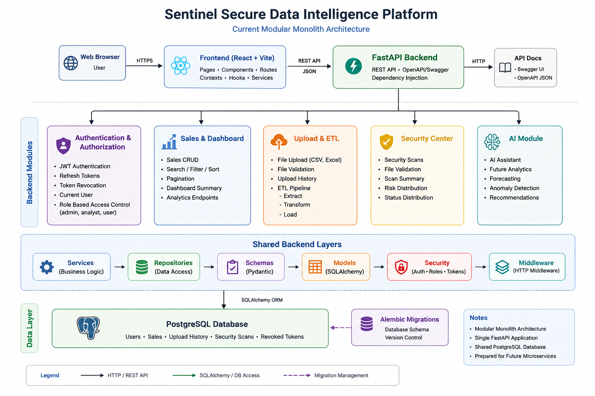

# System Architecture

## Overview

Sentinel Secure Data Intelligence Platform is currently built as a modular monolith.

The application uses a React frontend, a FastAPI backend, and PostgreSQL as the primary database. Backend functionality is separated into modules and shared application layers rather than being deployed as separate services.

This structure keeps the project relatively simple to develop and maintain while leaving room for individual modules to be separated into services later if the project requires it.

---

## Architecture Diagram

The following diagram shows the current application structure and the main relationships between the frontend, backend modules, shared backend layers, and database.



The diagram represents the current project direction. Some components, particularly the AI module, may still be under development and should not be considered fully implemented unless the corresponding functionality is available in the application.

---

## Application Structure

The application is divided into three main parts:

### Frontend

The frontend is built with React and Vite.

It is responsible for:

- User interface
- Page rendering
- Client-side routing
- Authentication state
- API communication
- Reusable UI components
- Dashboard and data visualization

The frontend source code is located in:

```text
frontend/src/