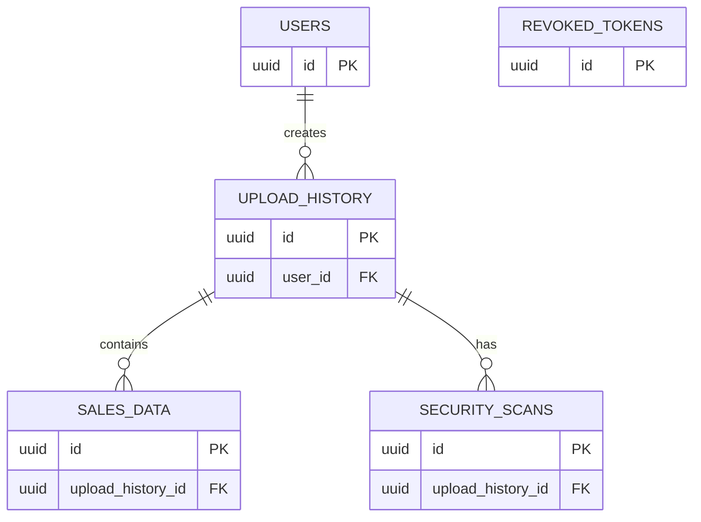

# Database ERD

## Overview

Sentinel Secure Data Intelligence Platform uses PostgreSQL as its primary database.

The current database models are defined in:

```text
backend/app/models/
├── user.py
├── sales_data.py
├── upload_history.py
├── security_scan.py
└── revoked_token.py
```

The ERD below represents the relationships defined by the current SQLAlchemy models.

---

## Entity Relationship Diagram



---

## Users

The `users` table stores application user records.

Model:

```text
backend/app/models/user.py
```

The user model is referenced by upload history records through `user_id`.

Relationship:

```text
users
  │
  └── upload_history
```

One user can have multiple upload history records.

---

## Upload History

The `upload_history` table records information about uploaded datasets and their processing status.

Model:

```text
backend/app/models/upload_history.py
```

Each upload history record belongs to a user through `user_id`.

An upload can also be associated with multiple sales records and security scan records.

Relationships:

```text
users
   │
   └── upload_history
          ├── sales_data
          └── security_scans
```

---

## Sales Data

The `sales_data` table stores sales records processed by the application.

Model:

```text
backend/app/models/sales_data.py
```

Sales records are associated with an upload through `upload_history_id`.

This allows the application to determine which upload produced a particular sales record.

Relationship:

```text
upload_history
      │
      └── sales_data
```

One upload history record can contain multiple sales records.

---

## Security Scans

The `security_scans` table stores security scan results associated with uploaded files.

Model:

```text
backend/app/models/security_scan.py
```

A security scan references its upload through `upload_history_id`.

Relationship:

```text
upload_history
      │
      └── security_scans
```

One upload can have multiple security scan records.

---

## Revoked Tokens

The `revoked_tokens` table stores revoked authentication tokens.

Model:

```text
backend/app/models/revoked_token.py
```

The current model does not define a foreign key relationship between `revoked_tokens` and `users`.

Therefore, the ERD does not show a direct relational connection between these tables.

```text
revoked_tokens
      │
      └── no FK relationship defined
```

---

## Relationship Summary

| Parent | Child | Relationship | Foreign Key |
|---|---|---|---|
| `users` | `upload_history` | One-to-many | `upload_history.user_id` |
| `upload_history` | `sales_data` | One-to-many | `sales_data.upload_history_id` |
| `upload_history` | `security_scans` | One-to-many | `security_scans.upload_history_id` |
| `users` | `revoked_tokens` | No direct relationship | None |

---

## Model Locations

The database models are maintained in:

```text
backend/app/models/
```

Current models:

```text
backend/app/models/user.py
backend/app/models/sales_data.py
backend/app/models/upload_history.py
backend/app/models/security_scan.py
backend/app/models/revoked_token.py
```

The ERD should be updated whenever the database models or their relationships change.